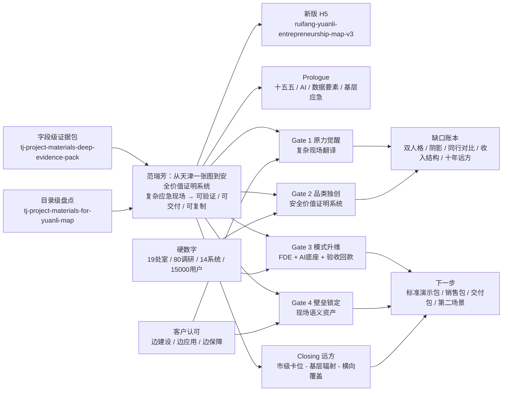

# TJ项目材料通关地图图谱

如果 Obsidian 的 Canvas 没有自动显示，请先打开同目录下的 [[TJ项目材料通关地图概念地图.canvas]]。

下面是同一张图的 Markdown / Mermaid 版本，普通笔记预览也能看到。

## 快速入口

- Canvas 版：[[TJ项目材料通关地图概念地图.canvas]]
- 深盘证据包：[[tj-project-materials-deep-evidence-pack]]
- 粗盘材料清单：[[tj-project-materials-for-yuanli-map]]
- 索引：[[TJ项目材料通关地图证据包索引]]

## 中心命题

范瑞芳真正卖出的不是“系统”，而是“安全价值被看见的能力”。

天津一张图不是终点，而是一个样板间：它把看不见的风险、散落的系统、割裂的处室和难以证明的安全工作，压缩成一套可演示、可上线、可验收、可复制的价值闭环。

