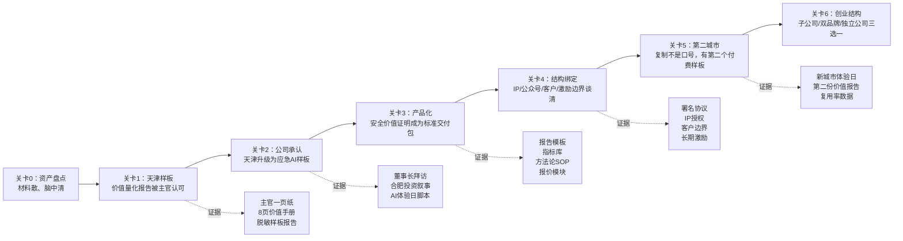

# 创业通关地图：瑞芳「安全价值证明」18 个月路线

生成日期：2026-06-01  
输入材料目录：`D:\yl-os\3业务输出`  
地图目标：把“天津项目负责人”通关到“安全价值证明品类创始人 / 应急 AI 子公司创始人候选”。

> 注：用户原词为“创业通过地图”，本文按语义理解为“创业通关地图”：关卡、钥匙、证据、风险、下一步。

## 0. 通关总公式

```
方法论结构 × 政治时机 × 客户关系 × 组织绑定 = 安全价值证明品类成立
```

当前最短路径：

```
天津样板跑通
  -> 主官认可安全价值证明
  -> 辰安承认天津是应急 AI 样板
  -> 方法论和数据资产产品化
  -> 谈清长期激励 / 子公司 / IP 边界
  -> 复制到第二城市
```

## 1. 当前状态判定

| 维度 | 当前状态 | 通关判断 |
|---|---|---|
| 方法论 | 安全价值量化、本体化应急、双循环、风险监管闭环已成型 | 已有“产品内核” |
| 样板 | 天津具备真实用户、实战场景、客户关系、奖项背书 | 已有“第一作品” |
| 组织 | 辰安 AI 战略、合肥投资窗口、董事长拜访材料正在汇合 | 处于“资源重排窗口” |
| 个人品牌 | 公众号与方法论署名刚启动 | 虚壁垒初建 |
| 商业模式 | 项目制为主，年费/订阅/报告费未稳定 | 财链路未闭环 |
| 风险 | IP 边界、客户归属、组织激励未谈清 | 最大未通关项 |

一句话：

> 现在不是 0 到 1，而是 1 到资产化；最大挑战不是创造，而是归属、复制和定价。

## 2. 创业通关主地图



## 3. 六大关卡拆解

### 关卡 1：天津样板被主官认可

**通关目标**  
让天津从“辰安项目”变成“主官可以拿去汇报的安全价值样板”。

**钥匙**  
价值量化报告、主官一页纸、价值手册 8 页、宣传片《看不见的守护》。

**必须证明**  

| 证明项 | 当前材料依据 | 缺口 |
|---|---|---|
| 系统确实被用 | 防汛、危化、指挥调度、掌上应急等材料 | 需要补最硬运行数据 |
| 价值能说清 | 安全价值量化三步法 | 需要压成主官语言 |
| 样板可复制 | 本体化应急、跨行业验证 | 需要做其他城市对标自测表 |

**通关动作**  
未来 7 天先补 3 个数据：预警/指令类、响应时间类、风险点/覆盖类。宁可少而硬，不要多而散。

### 关卡 2：辰安承认天津是公司级应急 AI 样板

**通关目标**  
让天津进入公司资源分配表，而不是停留在地方项目表。

**钥匙**  
《应急 AI 是合肥投资最好的落地场景》、董事长拜访议程、辰安 AI 产品战略。

**核心话术**  

> 天津是公司目前最能证明“AI 已落地、能复制、能被主官感知”的应急样板。

**通关动作**  
把内部表达从“天津项目需要支持”改成“合肥投资需要一个 AI 落地样板，而天津正好能承接这个叙事”。

### 关卡 3：「安全价值证明」产品化

**通关目标**  
让方法论可买、可报价、可交付、可复用。

**产品包建议**

| 产品 | 内容 | 目标客户 | 定价逻辑 |
|---|---|---|---|
| P1 城市安全价值诊断 | 现状盘点 + 价值缺口 + 对标自测 | 应急主官/园区 | 咨询诊断费 |
| P2 价值量化报告 | 投入-运行-产出-价值四层报告 | 已建系统城市 | 报告交付费 |
| P3 本体化升级路线图 | L1-L5 成熟度 + 三期路线 | 新建/升级项目 | 前期咨询费 |
| P4 AI 体验日 | 用样板场景演示应急 AI 能力 | 潜在城市客户 | 售前转化工具 |
| P5 年度价值复盘 | 每年生成安全价值报告 | 存量客户 | 年费订阅 |

**通关动作**  
做一页 `安全价值证明产品菜单`，先不谈大系统，只谈可交付的价值证明模块。

### 关卡 4：结构绑定谈清楚

**通关目标**  
把灰色地带变成可持续合作结构。

**四张谈判牌**

| 牌 | 要谈什么 | 最佳时机 |
|---|---|---|
| 方法论 IP | 三步法、四重过滤、本体化应急、双循环的署名与授权 | 天津报告被认可后 |
| 公众号边界 | 个人号还是公司认可的专家阵地 | 发布系列文章前 |
| 客户关系 | 存量客户、转介绍、新城市线索如何归属 | 委办局横拓前 |
| 激励机制 | 超额分红、项目奖金、子公司股权、长期绑定 | 天津升级公司样板后 |

**通关动作**  
不要一上来“要股权”。先用天津样板证明价值，再问组织：“这个赛道如果要长期做，核心团队怎么稳定投入？”

### 关卡 5：第二城市复制

**通关目标**  
证明天津不是瑞芳个人能力的偶然产物，而是一套可复制机制。

**第二城市的选择标准**

| 标准 | 说明 |
|---|---|
| 主官有汇报压力 | 安全价值证明才是强痛点 |
| 已有信息化基础 | 便于做投入产出复盘 |
| 有高频风险场景 | 防汛、危化、工贸、值班等 |
| 能接受体验日 | 缩短销售周期 |
| 辰安有进入渠道 | 降低获客成本 |

**通关动作**  
用天津脱敏报告换第二城市体验日，而不是直接卖平台。

### 关卡 6：选择创业结构

**三条路**

| 路线 | 适用条件 | 通关形态 |
|---|---|---|
| A 辰安内部创业 | 公司愿给资源、激励、边界 | 应急 AI 事业单元/子公司核心负责人 |
| B 双品牌共存 | 公司认可个人方法论，但暂不股权 | 辰安平台 + 瑞芳方法论联合交付 |
| C 独立公司 | 边界谈不清或长期激励缺失 | 安全价值证明独立咨询/产品公司 |

**当前建议**  
先按 B 走，争取 A，保留 C。  
也就是：先谈清边界和署名，再争取组织化资源，最后才判断是否独立。

## 4. 90 天行动图

| 时间 | 只做什么 | 不做什么 |
|---|---|---|
| 第 1 周 | 主官一页纸、董事长拜访材料、价值报告 3 个硬数据 | 不搭复杂工具、不扩写长篇方法论 |
| 第 2-4 周 | 价值手册 8 页、天津脱敏样板报告、产品菜单 | 不急着谈独立创业 |
| 第 2 月 | 应急 AI 体验日脚本、需求分析 SOP、资产沉淀清单 | 不把 OA AI 等旁支放到主线前面 |
| 第 3 月 | 内部结构谈判、第二城市候选筛选、公众号系列 2-3 篇 | 不公开敏感客户数据 |

## 5. 风险雷达

| 风险 | 早期信号 | 应对 |
|---|---|---|
| 客户敏感 | 对公众号/案例传播有顾虑 | 先送审，写方法论不写细节 |
| 组织抢功 | 天津变成“公司项目”，方法论无署名 | 把方法论写入交付物和内部材料 |
| 个人英雄化 | 客户只认瑞芳，公司不放心 | 双轨表达：辰安平台 × 瑞芳方法论 |
| 工具拖延 | 继续搭企业大脑而不交付报告 | 工具只服务四个 P0 材料 |
| 股权谈早 | 价值未证实前谈激励 | 等天津报告被认可后再谈结构 |
| 数据不足 | 报告全是方法论，没有硬指标 | 先补 3 个最硬数据 |

## 6. 通关仪表盘

| 指标 | 当前 | 30 天目标 | 90 天目标 |
|---|---:|---:|---:|
| 主官可用材料 | 0.6 | 1 页 + 8 页 | 完整脱敏报告 |
| 方法论产品化 | 0.5 | 产品菜单 | 可报价模块 |
| 公司资源承认 | 0.4 | 董事长拜访承接 | 公司级样板定位 |
| 个人品牌资产 | 0.3 | 公众号 2 篇 | 方法论系列稳定 |
| 结构绑定清晰度 | 0.2 | 议题准备 | 完成第一轮谈判 |
| 复制准备度 | 0.2 | 第二城市画像 | 体验日脚本 |

## 7. 每日决策过滤器

每天只问五个问题：

1. 这件事是否服务天津样板？
2. 这件事是否强化安全价值证明品类？
3. 这件事是否增加瑞芳的方法论署名和资产沉淀？
4. 这件事是否帮助辰安/投资方看见应急 AI 的可复制价值？
5. 这件事是否推动下一次真实对话，而不是只让材料更完美？

五个问题中少于三个为“是”，今天不做。

## 8. 通关结论

瑞芳的创业不是从离职那天开始，而是从天津被定义为“安全价值证明第一作品”那天开始。

最重要的不是现在选 A/B/C 哪条路，而是把所有路线都绕不开的筹码做硬：

> 天津样板 + 方法论署名 + 可复制产品 + 组织边界。

这四张牌在手，留在辰安是内部创业，双品牌是合作创业，离开辰安是独立创业；没有这四张牌，任何路线都会变成消耗战。
